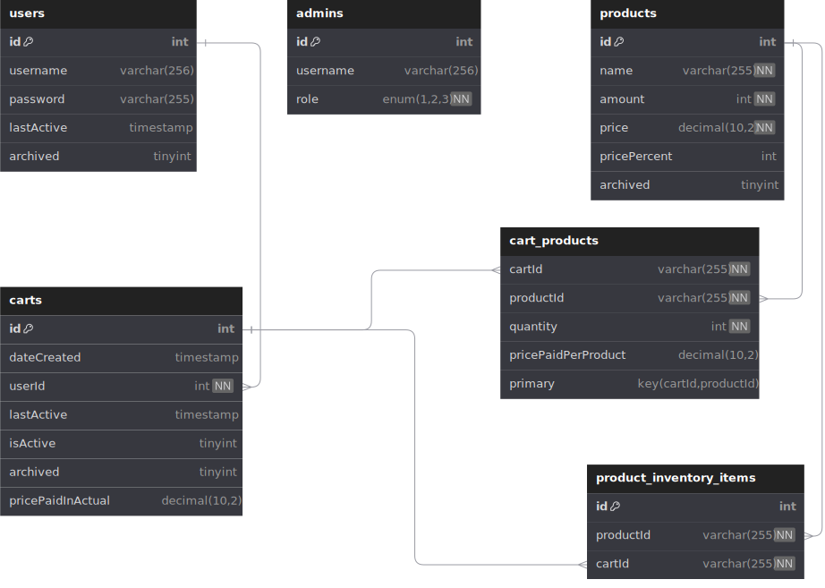

# Projet description

This project develops a comprehensive e-commerce backend system designed to manage users, carts, and products efficiently. The system is built on a robust architecture that includes a relational database and a server providing RESTful APIs for interaction with client applications.

Key Features
- User Management: The system supports full CRUD operations for users, including registration, updates, and soft deletion (archiving rather than actual deletion). Each user can manage their own carts and has a unique username and password stored securely.
- Cart Functionality: Users can create and manage carts, adding or removing products as needed. Carts track the total price paid and maintain a history of activity with timestamps.
- Product Management: The backend supports comprehensive management of product listings, including adding new products, updating existing listings, and handling inventory through a sub-table that tracks inventory items linked to specific carts.
## Architecture
- Database Schema: Utilizes UUIDs for primary keys to ensure global uniqueness across distributed systems. Tables include users, carts, products, product inventory items, and cart products, with appropriate relations and constraints to maintain data integrity.
- API Endpoints: Offers a range of endpoints for interacting with the database, allowing operations such as retrieving, adding, updating, and archiving records. Each main entity (user, cart, product) has endpoints dedicated to typical CRUD operations.
- Security and Data Integrity: Implements best practices such as password hashing and database constraints like foreign keys and unique indexes to ensure security and consistency of data.
- This backend system is designed to be scalable, secure, and efficient, providing a solid foundation for building a full-featured e-commerce platform.

# Resources

## Users
  <table>
    <thead>
      <tr>
        <th>Method</th>
        <th>Endpoint</th>
        <th>Description</th>
      </tr>
    </thead>
    <tbody>
      <tr>
        <td>GET</td>
        <td>/users</td>
        <td>Retrieve a list of all users</td>
      </tr>
      <tr>
        <td>GET</td>
        <td>/users/:uid</td>
        <td>Retrieve a specific user by ID</td>
      </tr>
      <tr>
        <td>GET</td>
        <td>/users/:uid/carts</td>
        <td>Retrieve all carts associated with a specific user</td>
      </tr>
      <tr>
        <td>POST</td>
        <td>/users</td>
        <td>Create a new user</td>
      </tr>
      <tr>
        <td>PUT</td>
        <td>/users/:uid</td>
        <td>Update an existing user by ID</td>
      </tr>
      <tr>
        <td>DELETE</td>
        <td>/users/:uid</td>
        <td>Soft delete a user by ID</td>
      </tr>
    </tbody>
  </table>

## Carts
  <table>
    <thead>
      <tr>
        <th>Method</th>
        <th>Endpoint</th>
        <th>Description</th>
      </tr>
    </thead>
    <tbody>
      <tr>
        <td>GET</td>
        <td>/carts</td>
        <td>Retrieve a list of all carts</td>
      </tr>
      <tr>
        <td>GET</td>
        <td>/carts/:cid</td>
        <td>Retrieve a specific cart by ID</td>
      </tr>
      <tr>
        <td>GET</td>
        <td>/carts/:cid/items</td>
        <td>Retrieve all items in a specific cart</td>
      </tr>
      <tr>
        <td>POST</td>
        <td>/carts</td>
        <td>Create a new cart</td>
      </tr>
      <tr>
        <td>PUT</td>
        <td>/carts/:cid</td>
        <td>Update a specific cart by ID</td>
      </tr>
      <tr>
        <td>DELETE</td>
        <td>/carts/:cid</td>
        <td>Delete a specific cart by ID</td>
      </tr>
    </tbody>
  </table>

## Cart Items
  <table>
    <thead>
      <tr>
        <th>Method</th>
        <th>Endpoint</th>
        <th>Description</th>
      </tr>
    </thead>
    <tbody>
      <tr>
        <td>GET</td>
        <td>/carts/:cid/items</td>
        <td>Retrieve all items in a specific cart</td>
      </tr>
      <tr>
        <td>POST</td>
        <td>/carts/:cid/items</td>
        <td>Add a new item to a cart (specify in body)</td>
      </tr>
      <tr>
        <td>PUT</td>
        <td>/carts/:cid/items/:itemId</td>
        <td>Update an item in a cart (e.g., change quantity)</td>
      </tr>
      <tr>
        <td>DELETE</td>
        <td>/carts/:cid/items/:itemId</td>
        <td>Remove an item from a cart</td>
      </tr>
    </tbody>
  </table>

## Products
  <table>
    <thead>
      <tr>
        <th>Method</th>
        <th>Endpoint</th>
        <th>Description</th>
      </tr>
    </thead>
    <tbody>
      <tr>
        <td>GET</td>
        <td>/products</td>
        <td>Retrieve a list of all products</td>
      </tr>
      <tr>
        <td>GET</td>
        <td>/products/:pid</td>
        <td>Retrieve a specific product by ID</td>
      </tr>
      <tr>
        <td>POST</td>
        <td>/products</td>
        <td>Create a new product</td>
      </tr>
      <tr>
        <td>PUT</td>
        <td>/products/:pid</td>
        <td>Update a specific product by ID</td>
      </tr>
      <tr>
        <td>DELETE</td>
        <td>/products/:pid</td>
        <td>Delete a specific product by ID</td>
      </tr>
    </tbody>
  </table>

# Structure

## Typescript interfaces
```ts
enum Role {
    SUPER = 1,
    ELEVATED = 2,
    STANDARD = 3
}

interface User {
    id: string;
    username: string; // Unique username
    name: string;
    lastActive: Date;
    password: string; // Stores hashed password
    carts: Cart[];
}

interface Admin {
    id: string;
    username: string; // Unique username
    role: Role;
}

interface Product {
    id: string;
    name: string;
    amount: number;
    price: number;
    pricePercent: number;
    inventoryItems?: ProductInventoryItem[];
}

interface ProductInventoryItem {
    id: string;
    productId: string;
    cartId: string | null;
}

interface CartProduct {
    productId: string;
    quantity: number;
    pricePaidPerProduct: number;
}

interface Cart {
    id: string;
    dateCreated: Date;
    userId: string;
    lastActive: Date;
    isActive: boolean;
    archived: boolean;
    pricePaidInActual: number | null;
    products: CartProduct[];
}
```

## SQL

```sql
CREATE TABLE `admins` (
	`id` int AUTO_INCREMENT NOT NULL,
	`username` varchar(256),
	`role` enum('1','2','3') NOT NULL DEFAULT '1',
	CONSTRAINT `admins_id` PRIMARY KEY(`id`),
	CONSTRAINT `admins_username_unique` UNIQUE(`username`)
);
--> statement-breakpoint
CREATE TABLE `carts` (
	`id` int AUTO_INCREMENT NOT NULL,
	`dateCreated` timestamp DEFAULT (now()),
	`userId` int NOT NULL,
	`lastActive` timestamp DEFAULT (now()) ON UPDATE CURRENT_TIMESTAMP,
	`isActive` tinyint DEFAULT 1,
	`archived` tinyint DEFAULT 0,
	CONSTRAINT `carts_id` PRIMARY KEY(`id`)
);
--> statement-breakpoint
CREATE TABLE `products` (
	`id` int AUTO_INCREMENT NOT NULL,
	`name` varchar(255) NOT NULL,
	`amount` int NOT NULL,
	`price` int NOT NULL,
	`archived` tinyint DEFAULT 0,
	CONSTRAINT `products_id` PRIMARY KEY(`id`)
);
--> statement-breakpoint
CREATE TABLE `products_inventory` (
	`productId` int NOT NULL,
	`cartId` int NOT NULL
);
--> statement-breakpoint
CREATE TABLE `users` (
	`id` int AUTO_INCREMENT NOT NULL,
	`username` varchar(256),
	`password` varchar(255),
	`lastActive` timestamp DEFAULT (now()),
	`archived` tinyint DEFAULT 0,
	CONSTRAINT `users_id` PRIMARY KEY(`id`),
	CONSTRAINT `users_username_unique` UNIQUE(`username`)
);
--> statement-breakpoint
ALTER TABLE `carts` ADD CONSTRAINT `carts_userId_users_id_fk` FOREIGN KEY (`userId`) REFERENCES `users`(`id`) ON DELETE no action ON UPDATE no action;--> statement-breakpoint
ALTER TABLE `products_inventory` ADD CONSTRAINT `products_inventory_productId_products_id_fk` FOREIGN KEY (`productId`) REFERENCES `products`(`id`) ON DELETE no action ON UPDATE no action;--> statement-breakpoint
ALTER TABLE `products_inventory` ADD CONSTRAINT `products_inventory_cartId_carts_id_fk` FOREIGN KEY (`cartId`) REFERENCES `carts`(`id`) ON DELETE no action ON UPDATE no action;
```